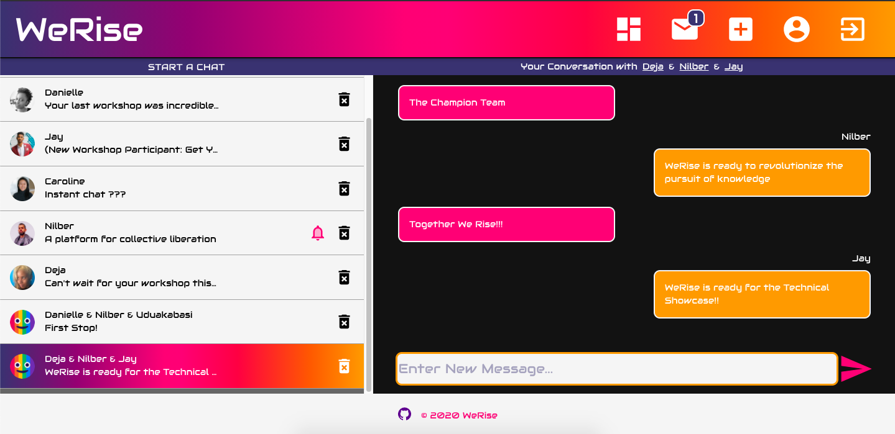
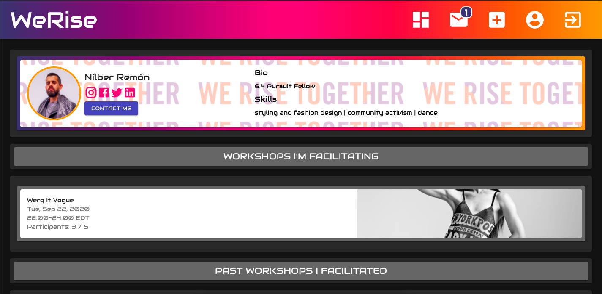

# WeRise
## Community Skills-Share VideoChat Platform

### Sharing Knowledge to Build Communities on the Rise

----------------------------

### [Live Demo - Web-Ready Only](https://werise.netlify.app/)

### Community Dashboard Page View

### Instant Messaging Chat Page View

### User Profile Page View

## How To

WeRise envisions building a community-driven platform where:

   - We can empower folx with new skills shared through their community that can advance their lives and livelihoods
   - Build new virtual community spaces by sharing knowledge and know-how.
   - Help push movements forward by creating and fostering spaces for equity, mutual aid and socioeconomic justice

How will WeRise realize this vision?:

   - Users will be able to Facilitate Workshops and Register for Workshops on a 1-on-1 basis or in Small Groups
   - Workshops can embrace any topic, interest or subject a user would like to share with the WeRise community.
   - Users will be able to create connections based on shared interests, experiences and destinations and build a virtual community for themselves

WeRise Primary Features:

   - Virtual Workshops conducted using VideoChat with In-Video Messaging & Screen-sharing
   - Workshop Feed with a Feature-Rich Search Engine
   - User Profiles for Engaging Your Community
   - User Real-time Communication: Instant Messaging

## Technical Base

WeRise was built using a tech stack comprising PostgreSQL, Firebase's Firestore NoSQL Cloud Database, Express, NodeJS and React. Material-UI was implemented as the base for designing and styling the UI/UX framework. 

### Future Specifications

   - (Push) Notifications
   - Content Management and Moderation
   - User Reviews, Rewards & Badges
   - User Subscriptions to Workshop Facilitators
   - User-Defined Interest Categories for Customized Default Feed
   - Tool for Donations to Facilitators and Users
